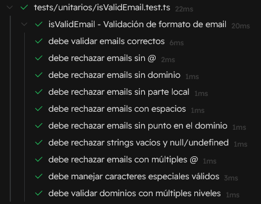
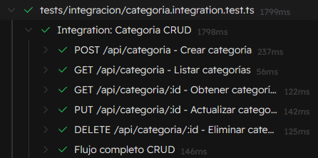

# Backend de Portal de Videojuegos

## Integrantes:

- 52479, Brizio Augusto
- 52850, Conti Stéfano
- 53137, Vitali Bruno

## Indice:

<a href="#1-instrucciones-de-instalación"><u>1. Instrucciones de instalación</u></a>

<a href="#2-instrucciones-para-su-uso"><u>2. Instrucciones para su uso</u></a>

<a href="#3-documentación-de-los-endpoints"><u>3. Documentación de los endpoints</u></a>

<a href="#4-Tests"><u>4. Tests</u></a>

<a href="#5-servicios-externos-usados"><u>5. Servicios externos usados</u></a>

## 1. Instrucciones de instalación

Todas las tecnologías utilizadas para el desarrollo y necesarias para el funcionamiento del backend están perfectamente documentadas en el **package.json**.

Para instalar las dependencias tendrá que abrir una terminal en la ruta **desarrollo-BE-tp/backend** y ejecutar el comando **pnpm install** y automáticamente comenzarán las descargas de los paquetes necesarios.

En cuanto la base de datos, nosotros utilizamos una imágen de Docker de MySQL (percona) la cual una vez instalado Docker en nuestra pc ejecutaremos el siguiente comando en bash para crear el contenedor de docker que va a contener la base de datos:

```
docker run --name ps8-portal-videojuegos -v C:\Users\user\docker-volumes\ps8-portal-videojuegos:/var/lib/mysql -e MYSQL_ROOT_HOST=% -e MYSQL_ALLOW_EMPTY_PASSWORD=yes -e MYSQL_PASSWORD=dsw -e MYSQL_USER=dsw -e MYSQL_DATABASE=portalvideojuegos -p 3307:3306 -d percona/percona-server
```

**Recordar la ruta luego de -v por el volumen donde queremos que se cree este contenedor**

Una vez corriendo el contenedor bastará con dirigirse dentro del proyecto de BE a la ruta **desarrollo-BE-tp/backend** y ejecutar el comando **pnpm run seed** por única vez para popular dicha base de datos.

## 2. Instrucciones para su uso

Como primera instancia debemos crear un archivo **.env** dentro de la carpeta **backend** el cual definiremos las siguientes variables de entorno:

_Ejemplo en el archivo .env.ejemplo_

Como segunda instancia para poder "correr" el backend de nuestra aplicación debemos levantar nuestro contenedor de Docker que tiene la base de datos ya populada.

Luego dirigirnos a la ruta **desarrollo-BE-tp/backend** que tiene todos los scripts para poder manejar el repositorio y ejecutar nuestro script **pnpm run dev** definido en el **package.json** que comienza a correr el backend en modo tsc-watch.

Como última medida se deberá en el apartado de puertos de VS Code crear un puerto que escuche al igual que nuestro backend en el **puerto 3000**, con visibilidad **pública** y método de comunicación **http**. Esto es necesario para poder hacer uso del **webhook** de MercadoPago cuando se trabaja en el ámbito de desarrollo.

## 3. Documentación de los endpoints

La documentación de los endpoints fue realizada usando la herramienta Open API de Swagger.

Para poder visualizar los endpoints se debe acceder a esta ruta desde el navegador **http://localhost:3000/api-docs/** (que está solo visible en el entorno de desarrollo para mayor seguridad).

Allí encontrará toda la información detallada de los endpoints que usa nuestra API Express junto a los parámetros, las respuestas y ejemplos de estos.

**Importante:** al contar con niveles de acceso para cada endpoint protegido Swagger nos permite probarlo al usar el cuadrado superior derecho "Authenticate" que recibe como campo el token de un login exitoso.

- Para poder hacer uso de los endpoints protegidos del cliente bastará con utilizar el endpoint Auth-Login con el ejemplo que está disponible y copiando el token de la respuesta.
- Para poder hacer uso de las rutas protegidas para el admin tendrá que usar el mismo endpoint pero con las credenciales que le fueron dadas para manejar el sitio como Administrador.

## 4. Tests

<a href="#41-tests-unitarios"><u>4.1 Tests unitarios</u></a>

<a href="#42-test-de-integración"><u>4.2 Test de integración</u></a>

Como herramienta de testing en esta parte del proyecto usamos **Vitest.**

### 4.1 Tests unitarios

**isValidEmail.test.ts**

Valida el helper isValidEmail con muchos posibles correos válidos (subdominios, + ,
dominios cortos) e inválidos (sin @ , múltiples @ , espacios, sin dominio/local). Mockea MikroORM y Usuario para importar el controlador sin inicializar la base.

_Foto éxito:_



**usuario.entity.test.ts**

Comprueba que la entidad Usuario hashea contraseñas en hashPasswordOnCreate, rehace el
hash si cambia en hashPasswordOnUpdate y evita rehashear cuando ya está en formato
bcrypt. Usa bcrypt.compare para verificar que los hashes corresponden a las contraseñas
originales.

_Foto éxito:_


**moderation.test.ts**

Mockea completamente la SDK de OpenAI para probar moderateText. Cubre: ausencia de
OPENAI_API_KEY (se permite el contenido), respuesta con flagged=true (bloquea y devuelve
categorías), flagged=false (permite), error de API (fallback permisivo) y uso de modelo
personalizado vía OPENAI_MODERATION_MODEL. Restaura variables de entorno entre
pruebas.

_Foto éxito:_


**checkout.sessionId.test.ts**

Replica la implementación de makeSessionId para verificar formato sess\_ , unicidad,
caracteres alfanuméricos, presencia del timestamp y longitud mínima que reduzca colisiones.
Sirve como regresión de la lógica de generación de IDs.

_Foto éxito:_


### 4.2 Test de integración

**categoria.integration.test.ts**

Levanta una app Express con MikroORM (MySQL) y entidades reales para testear el CRUD de
/api/categoria junto con el login /api/auth/login .
Cobertura:
_POST :_ éxito con token, fallo sin token, comportamiento actual con nombre vacío.
_GET listado y detalle:_ verifica presencia de campos y respuesta 500 en IDs inexistentes.
_PUT :_ actualización válida, error sin token y al apuntar a IDs que no existen.
_DELETE :_ elimina categorías, devuelve 401 sin token y confirma que hoy responde 200
aunque la categoría ya no exista.

_Flujo completo:_
crear→listar→obtener→actualizar→eliminar→verificar ausencia.

_Requisitos:_ MySQL accesible (por defecto localhost:3307 , user/pass dsw ),
usuario admin precargado ( portalvideojuegos@yahoo.com / clave: **\*\*** ) y
JWT_SECRET. Si falta el token imprime avisos y salta esos casos.

_Foto éxito:_



## 5. Servicios externos usados

En este apartado consideramos importante aclarar qué servicios externos utilizamos para completar funcionalidades de la página web.

Para procesar pagos utilizamos la **API** de **MercadoPago** (presente en el apartado de **Checkout**) en dónde luego de una respuesta exitosa del pago creamos y mostramos la venta en la UI.

_Nota: Para los pagos utilizamos las cuentas de prueba que nos proporciona MercadoPago_

Para manejar la subida y muestreo de fotos a través del sitio utilizamos un **blob storage** llamado **Cloudinary** en dónde registramos nuestra nube y utilizamos las credenciales que nos proporcionaron junto a su **API** para la subida y borrado de las fotos de los productos.

Nos pareció también una buena idea mantener comunicación constante con los clientes para que estén enterados de todos los eventos relacionados con ellos, para esto utilizamos la **API** de **Nodemailer**. Creamos una cuenta de mail que es la encargada del envío de mails y a través de su **App Password** que creamos se hace uso de esta API.

_Nota: Nos pareció buena idea tener separados los mails para el envío automático de notificaciones del que usa el administrador, por ende este mail mencionado arriba es distinto de al que le llegan las consultas hechas por los usuarios desde la UI (este es el del admin)._

Para finalizar la funcionalidad de la página usamos la **API** de **OpenAI** con su modelo gratuito para moderar las reseñas que los usuarios crean y/o editan para que si el modelo evalúa que el comentario no es apropiado se lo rechaza inmediatamente respondiendo con las categorías que el modelo cree que está infringiendo (abuso verbal/odio/etc).
